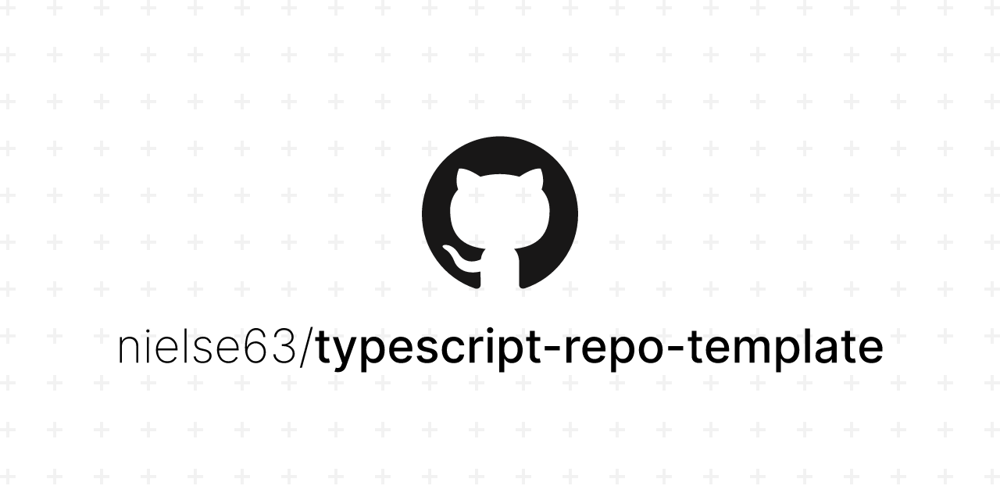

# typescript-repo-template

> A GitHub repo template for TypeScript projects

<div align="center">
  <div>
    
    
    
    
    
  </div>

  <a href="https://github.com/nielse63/typescript-repo-template">
    
  </a>
</div>

## Features

- TypeScript - Pre-configured TypeScript configuration integrated with eslint and jest
- GitHub Actions - PR checks, dependabot, automerge, and repo settings pre-configured
- Git Hooks - Format staged files using lint-staged and husky
- Pre-Configured Formatters - eslint, prettier, airbnb-typescript-config, and .editorconfig baked in
- Unit Tests - Run TypeScript unit tests with jest
- Interactive Setup Script - takes the hassle out of initializing your repository

### Prerequisites

For the best results, make sure you have the correct version of node installed:

```bash
nvm install v22.21.0
```

### Installation

#### Using GitHub CLI

```bash
# create the repo and clone it
gh repo create my-awesome-project \
  --template nielse63/typescript-repo-template \
  --clone
cd my-awesome-project

# run the setup script
npm run setup
```

#### Manually via git

```bash
# clone the repo into a custom directory
git clone https://github.com/nielse63/typescript-repo-template my-awesome-project
cd my-awesome-project

# run the setup script
npm run setup
```

## Usage

### NPM Scrtips

| script            | desription                        |
| ----------------- | --------------------------------- |
| `npm test`        | run unit tests with jest          |
| `npm start`       | execute the module from `./dist`  |
| `npm run dev`     | execute the module from `./src`   |
| `npm run lint`    | format and lint files             |
| `npm run build`   | compile source to `./dist`        |
| `npm run docs`    | build API docs                    |
| `npm run release` | release package to npm and github |

## Roadmap

- [x] Add Changelog
- [x] Add default values for setup script
- [ ] Move `.bin/scripts` to it's own package
- [ ] Utilize plop
- [ ] Write tests for setup and backup scripts

See the [open issues](https://github.com/nielse63/typescript-repo-template/issues) for a full list of proposed features (and known issues).

## Contributing

Contributions are what make the open source community such an amazing place to learn, inspire, and create. Any contributions you make are **greatly appreciated**.

If you have a suggestion that would make this better, please fork the repo and create a pull request. You can also simply open an issue with the tag "enhancement". Don't forget to give the project a star! Thanks again!

1. Fork the Project
2. Create your Feature Branch (`git checkout -b scratch/my-feature`)
3. Commit your Changes (`git commit -m 'added new feature'`)
4. Push to the Branch (`git push origin scratch/my-feature`)
5. Open a Pull Request

## License

Distributed under the MIT License. See [`LICENSE`](https://github.com/nielse63/typescript-repo-template/blob/main/LICENSE) for more information.

## Contact

Project Link: [https://github.com/nielse63/typescript-repo-template](https://github.com/nielse63/typescript-repo-template)
